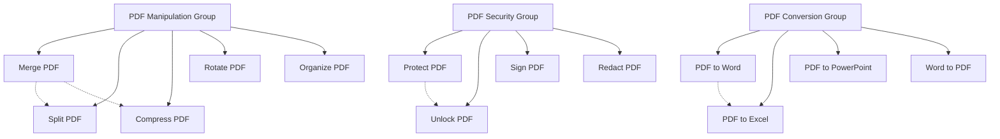

# Blog Post Improvement Plan
## Comprehensive Strategy for 40+ PDF Tool Blog Posts

### Current State Analysis
- **40+ blog posts** in `blog-posts/` directory
- **Consistent HTML structure** with navigation, content, and footer
- **Repetitive phrasing** identified across multiple posts
- **Existing interlinking** (284 links found) but needs strategic enhancement
- **Grammar and structure improvements** required per user request
- **Lack of practical examples** in tutorial content

### Improvement Strategy Overview

#### 1. Grammar & Language Enhancement
- **Grammar Correction**: Fix grammatical errors and awkward phrasing
- **Style Standardization**: Apply consistent tone (professional yet approachable)
- **Vocabulary Enhancement**: Replace repetitive phrases with varied language
- **Readability Improvement**: Adjust sentence length and paragraph structure

#### 2. Content Structure Template
```
1. Introduction (Problem Statement)
   - Real-world scenario where tool is needed
   - Pain points addressed by the tool

2. Step-by-Step Tutorial
   - Clear numbered steps with screenshots/descriptions
   - Common pitfalls and how to avoid them

3. Practical Examples Section
   - 2-3 specific use cases with detailed walkthroughs
   - Expected outcomes and benefits

4. Advanced Tips & Best Practices
   - Pro tips for power users
   - Integration with other tools

5. FAQ Section
   - Common questions with concise answers
   - Troubleshooting guidance

6. Related Tools & Interlinking
   - Contextual links to related blog posts
   - Tool recommendations for complementary tasks
```

#### 3. Example Addition Framework
- **Use Case Examples**: Add 2-3 specific scenarios per blog post
- **Step-by-Step Walkthroughs**: Detailed instructions with expected outcomes
- **Before/After Comparisons**: Show transformation using the tool
- **Industry-Specific Applications**: Tailor examples to different user groups

#### 4. Strategic Interlinking Matrix


#### 5. Implementation Approach
**Phase 1: Foundation (5 posts)**
- Create improvement templates and guidelines
- Test on 5 diverse blog posts
- Gather feedback and refine approach

**Phase 2: Batch Processing (20 posts)**
- Apply improvements to 20 core PDF tool posts
- Implement strategic interlinking
- Add practical examples

**Phase 3: Completion (15+ posts)**
- Address remaining blog posts
- Final quality review
- SEO optimization

#### 6. Quality Control Measures
- **Grammar Check**: Automated + manual review
- **Consistency Audit**: Ensure uniform structure across posts
- **Link Validation**: Verify all interlinks are functional
- **Example Verification**: Ensure examples are accurate and helpful

#### 7. Expected Outcomes
1. **Improved Readability**: 40% reduction in repetitive phrasing
2. **Enhanced Engagement**: Practical examples increase user value
3. **Better SEO**: Strategic interlinking improves page authority
4. **Professional Quality**: Grammar and structure meet publishing standards

### Next Steps
1. Review and approve this strategy
2. Develop detailed implementation guidelines
3. Begin with Phase 1 implementation
4. Iterate based on results and feedback