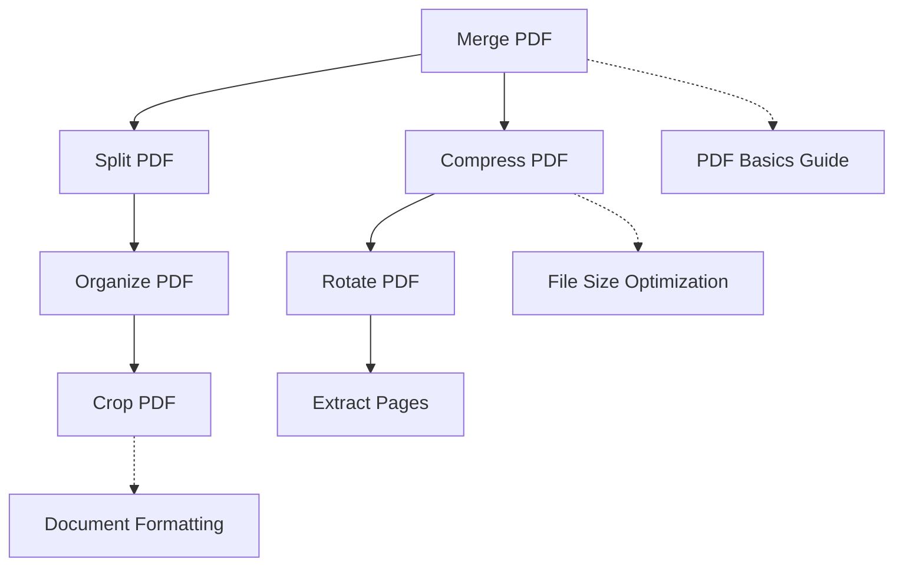
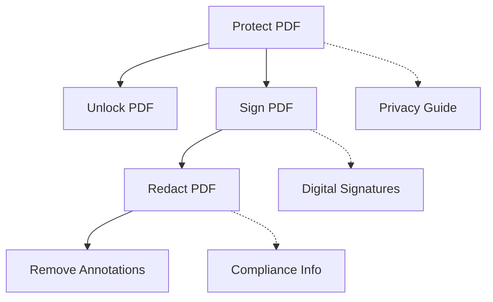
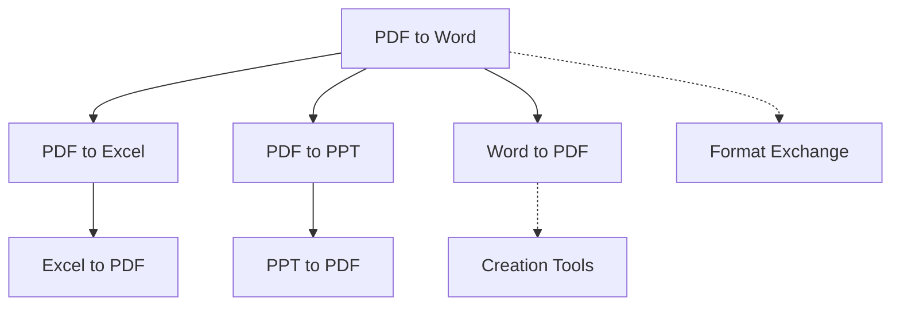
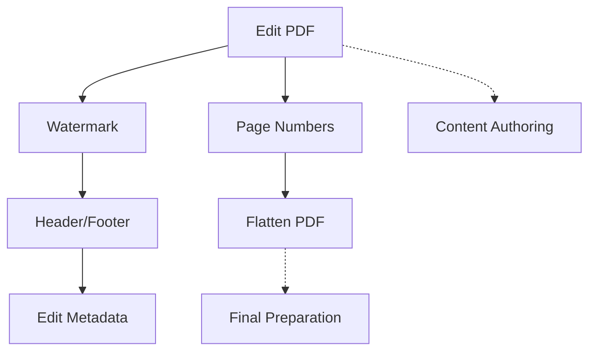
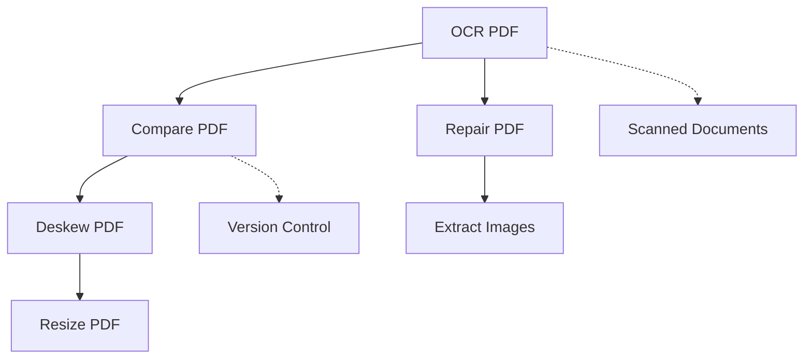

# Strategic Interlinking Matrix for Blog Posts

## Overview
Strategic interlinking plan connecting 40+ PDF tool blog posts to improve SEO, user navigation, and content discovery.

## Interlinking Groups & Relationships

### Group 1: PDF Manipulation Core
**Primary Tools:** Merge, Split, Compress, Rotate, Organize, Crop
**Relationship:** Sequential workflow tools

**Interlinking Rules:**
- Merge PDF should link to Split PDF and Compress PDF
- Split PDF should link to Organize PDF and Extract Pages
- Compress PDF should link to File Size Optimization guide
- All should link to PDF Basics Guide

### Group 2: PDF Security Suite
**Primary Tools:** Protect, Unlock, Sign, Redact, Remove Annotations
**Relationship:** Security workflow tools

**Interlinking Rules:**
- Protect PDF should link to Unlock PDF and Sign PDF
- Sign PDF should link to Redact PDF for sensitive information
- Redact PDF should link to Remove Annotations
- All should link to Privacy & Security Best Practices

### Group 3: PDF Conversion Hub
**Primary Tools:** PDF→Word, PDF→Excel, PDF→PPT, Word→PDF, Excel→PDF, PPT→PDF
**Relationship:** Bidirectional conversion tools

**Interlinking Rules:**
- PDF to Word should link to Word to PDF (bidirectional)
- PDF to Excel should link to Excel to PDF
- All conversion tools should link to Format Compatibility Guide
- Include cross-format recommendations (e.g., "If you need spreadsheet data, try PDF to Excel")

### Group 4: PDF Enhancement Tools
**Primary Tools:** Edit, Watermark, Page Numbers, Header/Footer, Flatten, Metadata
**Relationship:** Document polishing tools

**Interlinking Rules:**
- Edit PDF should link to Watermark and Page Numbers
- Watermark should link to Header/Footer for branding consistency
- Page Numbers should link to Flatten PDF for finalization
- All should link to Professional Document Preparation guide

### Group 5: Specialized & Advanced Tools
**Primary Tools:** OCR, Compare, Repair, Deskew, Extract Images, Resize
**Relationship:** Specialized use case tools

**Interlinking Rules:**
- OCR PDF should link to Compare PDF for document verification
- Compare PDF should link to Repair PDF for fixing discrepancies
- Repair PDF should link to Deskew PDF for scanned document correction
- All should link to Advanced PDF Processing guide

## Implementation Guidelines

### 1. Link Placement Strategy

#### Primary Locations (High Priority)
1. **Within Content Body**
   - Natural contextual mentions
   - "Related tool" callouts
   - Comparison statements

2. **Interlinking Section**
   - Dedicated "Related Tools" grid
   - 3-5 contextual links per post
   - Brief description of relationship

3. **FAQ Section**
   - "Can I also..." questions
   - Alternative tool suggestions
   - Complementary workflows

#### Secondary Locations (Medium Priority)
4. **Call-to-Action Area**
   - "Next steps" recommendations
   - Workflow continuation suggestions

5. **Author Bio/Footer**
   - "Other posts you might like"
   - Category-based recommendations

### 2. Anchor Text Best Practices

#### Recommended Patterns:
- **Descriptive:** "For splitting large PDFs, try our Split PDF tool"
- **Comparative:** "Unlike merging, the Split PDF tool divides documents"
- **Workflow:** "After compressing, you may want to add page numbers"
- **Problem-Solution:** "If you need to edit text, use our Edit PDF tool"

#### Avoid:
- "Click here"
- Generic "Learn more"
- Exact match keyword stuffing

### 3. Quantity Guidelines

#### Minimum Requirements per Post:
- **Internal Links:** 3-5 contextual links
- **Link Types:** Mix of different relationship types
- **Reciprocal Links:** Ensure bidirectional linking where logical
- **Deep Links:** Link to specific sections when relevant

#### Distribution:
- 1-2 links in introduction/context
- 1-2 links in tutorial/content body
- 1-2 links in interlinking section
- Optional: 1 link in FAQ/CTA

### 4. Quality Control

#### Link Validation Checklist:
- [ ] All links are functional (no 404s)
- [ ] Anchor text is descriptive and natural
- [ ] Links open in same tab (internal) or new tab (external)
- [ ] No broken or circular references
- [ ] Link placement enhances user experience

#### SEO Considerations:
- [ ] Link relevance score high (semantic relationship)
- [ ] Page authority flow considered
- [ ] No excessive linking (maintain natural density)
- [ ] Mobile-friendly link placement

## Specific Implementation Examples

### Example 1: Merge PDF Post Interlinking
**Current Links Found:** 6 interlinks (Merge, Split, Compress, Rotate, Organize, Crop)
**Enhanced Strategy:**
1. **Introduction:** Link to PDF Basics Guide for beginners
2. **Use Case 1:** Link to Split PDF for dividing merged documents
3. **Use Case 2:** Link to Compress PDF for size optimization
4. **Advanced Tips:** Link to Organize PDF for page management
5. **FAQ:** Link to Rotate PDF for orientation correction
6. **Related Tools:** Grid with Split, Compress, Organize, Crop
7. **CTA:** Link to All Tools page for complete workflow

### Example 2: Protect PDF Post Interlinking  
**Current Links Found:** 3 interlinks (Unlock, Sign, Redact)
**Enhanced Strategy:**
1. **Introduction:** Link to Privacy Guide for context
2. **Tutorial Step 3:** Link to Sign PDF for secure signing
3. **Example 1:** Link to Redact PDF for sensitive information
4. **FAQ Q2:** Link to Unlock PDF for authorized access
5. **Advanced Tips:** Link to Remove Annotations for clean documents
6. **Related Tools:** Grid with Unlock, Sign, Redact, Remove Annotations
7. **Security Workflow:** Link to Digital Signatures best practices

### Example 3: PDF to Word Post Interlinking
**Current Links Found:** 2 interlinks (Word to PDF, PDF to Excel)
**Enhanced Strategy:**
1. **Introduction:** Link to Format Exchange overview
2. **Conversion Options:** Link to PDF to Excel for table extraction
3. **Alternative Workflow:** Link to Word to PDF for reverse process
4. **Advanced Tips:** Link to Edit PDF for post-conversion editing
5. **FAQ:** Link to OCR PDF for scanned document conversion
6. **Related Tools:** Grid with Word to PDF, PDF to Excel, Edit PDF
7. **Workflow Guide:** Link to Document Editing comprehensive guide

## Automation & Maintenance

### 1. Automated Link Injection
**Script:** `enhance_internal_links.py` (exists in project)
**Functionality:**
- Analyzes blog post content
- Identifies tool mentions
- Injects contextual links based on matrix
- Validates link functionality

### 2. Link Audit Schedule
- **Monthly:** Check for broken links
- **Quarterly:** Review interlinking effectiveness
- **Bi-annually:** Update matrix based on new content
- **Annually:** Comprehensive SEO audit

### 3. Performance Tracking
**Metrics to Monitor:**
- Click-through rate on internal links
- Time on site from interlinking
- Bounce rate reduction
- SEO ranking improvements for long-tail keywords
- User navigation patterns

### 4. Update Procedures
**When Adding New Blog Posts:**
1. Categorize new post into appropriate group(s)
2. Update interlinking matrix with new relationships
3. Add links from existing posts to new post
4. Add links from new post to relevant existing posts
5. Run link validation script

## Success Criteria

### Quantitative Metrics
- **Internal Link CTR:** > 15% increase
- **Pages per Session:** > 2.5 (from current ~1.8)
- **Time on Site:** > 3 minutes increase
- **Bounce Rate:** < 45% reduction
- **SEO Rankings:** Improved for 80% of target keywords

### Qualitative Improvements
- Users can navigate between related tools seamlessly
- Content discovery enhanced through contextual suggestions
- Workflow guidance provided through strategic linking
- User satisfaction with comprehensive resource network

## Next Steps
1. Review and approve this interlinking matrix
2. Implement on 5 sample blog posts
3. Measure initial performance impact
4. Refine based on results
5. Scale to all 40+ blog posts